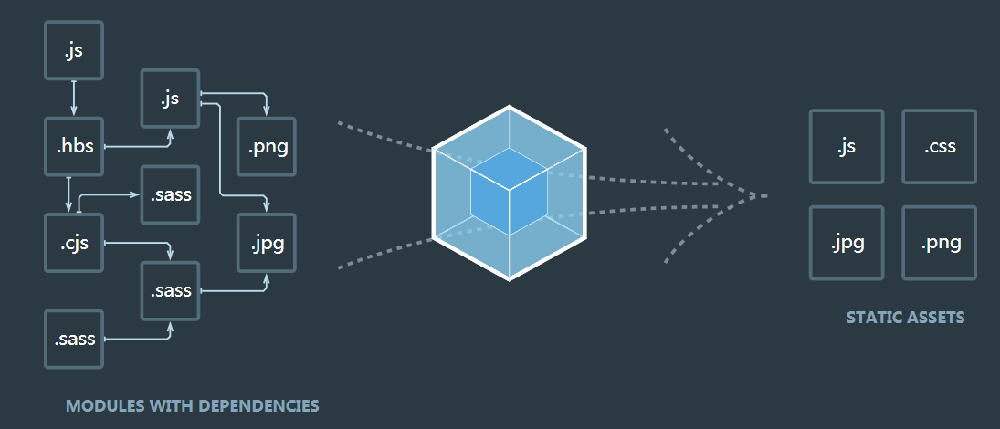

# 目录

- [概念](#概念)
- [安装](#安装)
- [Getting started](#Getting-started)
  - [实现最简项目](#实现最简项目)
- [管理资源](#管理资源)

# 概念

本质上，webpack 是一个现代 JavaScript 应用程序的静态模块打包器(module bundler)。当 webpack 处理应用程序时，它会递归地构建一个依赖关系图(dependency graph)，其中包含应用程序需要的每个模块，然后将所有这些模块打包成一个或多个 bundle。

示意图：



关键概念：

* 入口(entry)
* 输出(output)
* loader
* 插件(plugins)

# 安装

在开始之前，请确保安装了 **Node.js** 的最**新版本**。

全局安装方式不推荐。

推荐**本地安装**方式：

要安装最新版本或特定版本，请运行以下命令之一：

安装最新版本

```bash
npm install --save-dev webpack
```

安装指定版本

```bash
npm install --save-dev webpack@<version>
```

如果你使用 webpack 4+ 版本，你还需要安装 CLI。

```bash
npm install --save-dev webpack-cli
```

## Getting started

创建项目目录。

执行如下命令:

```bash
// -y就是yes的意思，在init的时候省去了敲回车的步骤，生成的默认的package.json
npm init -y
npm install webpack webpack-cli --save-dev
```
## 实现最简项目

项目**目录结构**：

```
wp
|- package.json
|- webpack.config.js
|- /dist
  |- main.js
  |- index.html
|- /src
  |- index.js
|- /node_modules
```
**webpack.config.js:**
```
const path = require('path');

module.exports = {
    entry: './src/index.js',
    output: {
        filename: 'main.js',
        path: path.resolve(__dirname, 'dist')
    }
};
```
**dist/index.html:**

```html
<!doctype html>
<html>

<head>
    <title>最简项目</title>
</head>

<body>
    <script src="main.js"></script>
</body>

</html>
```
**src/index.js**:

```
function component() {
  var element = document.createElement('div');
  element.innerHTML = 'webpack test';
  return element;
}

document.body.appendChild(component());
```
**package.json增加:**
```
{
  ...
    
  "scripts": {
    "test": "echo \"Error: no test specified\" && exit 1",
+   "build": "webpack"
  },
    
  ...
}
```
执行 npm run build 命令，在dist目录下生成main.js文件。

# 管理资源

## 加载CSS

安装并添加 style-loader 和 css-loader：
```
npm install --save-dev style-loader css-loader
```
webpack.config.js中添加
```
  const path = require('path');

  module.exports = {
    entry: './src/index.js',
    output: {
      filename: 'bundle.js',
      path: path.resolve(__dirname, 'dist')
    },
+   module: {
+     rules: [
+       {
+         test: /\.css$/,
+         use: [
+           'style-loader',
+           'css-loader'
+         ]
+       }
+     ]
+   }
  };
```
> webpack 根据正则表达式，来确定应该查找哪些文件，并将其提供给指定的 loader。在这种情况下，以 .css 结尾的全部文件，都将被提供给 style-loader 和 css-loader。

> 这使你可以在依赖于此样式的文件中 import './style.css'。现在，当该模块运行时，含有 CSS 字符串的 <style> 标签，将被插入到 html 文件的 <head> 中。

> css-loader: 解释(interpret) @import 和 url() ，会 import/require() 后再解析(resolve)它们。

> style-loader: Adds CSS to the DOM by injecting a <style> tag

举例：

src/style.css

```
.content {
    color:green;
}
```
src/index.js

```
import './style.css'
function component() {
  var element = document.createElement('div');
  element.innerHTML = 'webpack test';
  element.classList.add('content');
  return element;
}

document.body.appendChild(component());
```

## 加载图片

使用 file-loader，我们可以轻松地将这些内容混合到 CSS 中：
```
npm install --save-dev file-loader
```
webpack.config.js文件增加
```
  const path = require('path');

  module.exports = {
    
    ...
    
    module: {
      rules: [
      
        ...
        
+       {
+         test: /\.(png|svg|jpg|gif)$/,
+         use: [
+           'file-loader'
+         ]
+       }
      ]
    }
  };
```

举例：
src/index.js
```
  import _ from 'lodash';
  import './style.css';
+ import Icon from './icon.png';

  function component() {
    var element = document.createElement('div');
    ...

+   // 将图像添加到我们现有的 div。
+   var myIcon = new Image();
+   myIcon.src = Icon;
+
+   element.appendChild(myIcon);

    return element;
  }

  document.body.appendChild(component());
```
或

src/style.css
```
  .hello {
    color: red;
+   background: url('./icon.png');
  }
```
## 加载字体

那么，像字体这样的其他资源如何处理呢？file-loader 和 url-loader 可以接收并加载任何文件，然后将其输出到构建目录。这就是说，我们可以将它们用于任何类型的文件，包括字体。

webpack.config.js：
```
  const path = require('path');

  module.exports = {
    ...
    module: {
      rules: [
        ...
        
+       {
+         test: /\.(woff|woff2|eot|ttf|otf)$/,
+         use: [
+           'file-loader'
+         ]
+       }
      ]
    }
  };
```

举例：

src/style.css
```
+ @font-face {
+   font-family: 'MyFont';
+   src:  url('./my-font.woff2') format('woff2'),
+         url('./my-font.woff') format('woff');
+   font-weight: 600;
+   font-style: normal;
+ }

  .hello {
    color: red;
+   font-family: 'MyFont';
    background: url('./icon.png');
  }
```
## 加载数据

* 可以加载的有用资源还有数据，如 JSON 文件，CSV、TSV 和 XML。
* JSON 支持实际上是内置的(例如，直接使用import Data from './data.json' 默认将正常运行）。
* 导入 CSV、TSV 可以使用 csv-loader
* 导入 XML可以使用 xml-loader

安装
```
npm install --save-dev csv-loader xml-loader
```
webpack.config.js
```
  const path = require('path');

  module.exports = {
    
    module: {
      rules: [
        ...
        
+       {
+         test: /\.(csv|tsv)$/,
+         use: [
+           'csv-loader'
+         ]
+       },
+       {
+         test: /\.xml$/,
+         use: [
+           'xml-loader'
+         ]
+       }
      ]
    }
  };  
```

现在，你可以 import 这四种类型的数据(JSON, CSV, TSV, XML)中的任何一种。

# 管理输出

到目前为止，我们在 index.html 文件中手动引入所有资源，然而随着应用程序增长，并且一旦开始对文件名使用哈希(hash)]并输出多个 bundle，手动地对 index.html 文件进行管理，一切就会变得困难起来。然而，可以通过一些插件，会使这个过程更容易操控。

## 设定 HtmlWebpackPlugin 

首先安装插件：
```
npm install --save-dev html-webpack-plugin
```
webpack.config.js
```
  const path = require('path');
+ const HtmlWebpackPlugin = require('html-webpack-plugin');

  module.exports = {
    ...
    
+   plugins: [
+     new HtmlWebpackPlugin({
+       title: 'Output Management'
+     })
+   ],
    
    ...
    
  };
```
HtmlWebpackPlugin 还是会默认生成 index.html 文件。这就是说，它会用新生成的 index.html 文件，把我们的原来的替换。

执行npm run build后，如果你在代码编辑器中将 index.html 打开，你就会看到 HtmlWebpackPlugin 创建了一个全新的文件，所有的 bundle 会自动添加到 html 中。

## 清理 /dist 文件夹 

通常，在每次构建前清理 /dist 文件夹，是比较推荐的做法，因此只会生成用到的文件。

clean-webpack-plugin 是一个比较普及的管理插件，让我们安装和配置下。
```
npm install clean-webpack-plugin --save-dev
```
webpack.config.js
```
  const path = require('path');
  const HtmlWebpackPlugin = require('html-webpack-plugin');
+ const CleanWebpackPlugin = require('clean-webpack-plugin');

  module.exports = {
    entry: {
      app: './src/index.js',
      print: './src/print.js'
    },
    plugins: [
+     new CleanWebpackPlugin(['dist']),
      new HtmlWebpackPlugin({
        title: 'Output Management'
      })
    ],
    output: {
      filename: '[name].bundle.js',
      path: path.resolve(__dirname, 'dist')
    }
  };
```
现在执行 npm run build，再检查 /dist 文件夹。如果一切顺利，你现在应该不会再看到旧的文件，只有构建后生成的文件！

## Manifest?????????????????????????????????????????????????????

# 开发环境

## 使用 source map 

当 webpack 打包源代码时，可能会很难追踪到错误和警告在源代码中的原始位置。例如，如果将三个源文件（a.js, b.js 和 c.js）打包到一个 bundle（bundle.js）中，而其中一个源文件包含一个错误，那么堆栈跟踪就会简单地指向到 bundle.js。这并通常没有太多帮助，因为你可能需要准确地知道错误来自于哪个源文件。

为了更容易地追踪错误和警告，JavaScript 提供了 source map 功能，将编译后的代码映射回原始源代码。如果一个错误来自于 b.js，source map 就会明确的告诉你。

source map 有很多不同的选项可用，我们使用 inline-source-map 选项为例作为说明：

在 print.js 文件中生成一个错误：

src/print.js
```
  export default function printMe() {
-   console.log('I get called from print.js!');
+   cosnole.error('I get called from print.js!');
  }
```
npm run build 之后，浏览器控制台定位错误在app.bundle.js文件：
```
app.bundle.js:1 I get called from print.js!
r @ app.bundle.js:1
```
做如下修改：

webpack.config.js
```
const path = require('path');
  const HtmlWebpackPlugin = require('html-webpack-plugin');
  const CleanWebpackPlugin = require('clean-webpack-plugin');

  module.exports = {
    entry: {
      app: './src/index.js',
      print: './src/print.js'
    },
+   devtool: 'inline-source-map',
    ...
  };
```
执行npm run build，并在浏览器运行，可以定位错误在源文件print.js
```
I get called from print.js!
r @ print.js:2
```
source map帮助定位了问题的确切位置。

## 开发工具

* webpack's Watch Mode
* webpack-dev-server
* webpack-dev-middleware

### 观察模式（Watch Mode）

添加一个用于启动 webpack 的观察模式的 npm script 脚本：

package.json
```
  {
    ...
    
    "scripts": {
      "test": "echo \"Error: no test specified\" && exit 1",
+     "watch": "webpack --watch",
      "build": "webpack"
    },
    
    ...
  }
```
命令行中运行 npm run watch，然后就会看到 webpack 是如何编译代码。 然而，你会发现并没有退出命令行。这是因为 script 脚本当前还在观察文件。

修改并保存文件并检查终端窗口。应该可以看到 webpack 自动重新编译修改后的模块！

> 唯一的缺点是，为了看到修改后的实际效果，你需要刷新浏览器。

### webpack-dev-server

webpack-dev-server 为你提供了一个简单的 web 服务器，并且能够实时重新加载(live reloading)。让我们设置以下：
```
npm install --save-dev webpack-dev-server
```
修改配置文件，告诉开发服务器(dev server)，在哪里查找文件：

webpack.config.js
```
  const path = require('path');
  const HtmlWebpackPlugin = require('html-webpack-plugin');
  const CleanWebpackPlugin = require('clean-webpack-plugin');

  module.exports = {
    entry: {
      app: './src/index.js',
      print: './src/print.js'
    },
    devtool: 'inline-source-map',
+   devServer: {
+     contentBase: './dist'
+   },

    ...
    
  };
```
以上配置告知 webpack-dev-server，在 localhost:8080 下建立服务，将 dist 目录下的文件，作为可访问文件。

让我们添加一个 script 脚本，可以直接运行开发服务器(dev server)：

package.json
```
  {
    ...
    
    "scripts": {
      "test": "echo \"Error: no test specified\" && exit 1",
      "watch": "webpack --watch",
+     "start": "webpack-dev-server --open",
      "build": "webpack"
    },
    ...
  }
```
现在，我们可以在命令行中运行 npm start，就会看到浏览器自动加载页面。如果现在修改和保存任意源文件，web 服务器就会自动重新加载编译后的代码。

#### Hot Module Replacement?????????????????????????????????????????????????????????

### 使用 webpack-dev-middleware

webpack-dev-middleware 是一个容器(wrapper)，它可以把 webpack 处理后的文件传递给一个服务器(server)。 webpack-dev-server 在内部使用了它，然而它也可以作为一个单独的 package 来使用，以便根据需求进行更多自定义设置。

# 热模块替换

## 启用 HMR 

此功能可以很大程度提高生产效率。

webpack.config.js
```
  const path = require('path');
  const HtmlWebpackPlugin = require('html-webpack-plugin');
  const CleanWebpackPlugin = require('clean-webpack-plugin');
+ const webpack = require('webpack');

  module.exports = {
    entry: {
-      app: './src/index.js',
-      print: './src/print.js'
+      app: './src/index.js'
    },
    devtool: 'inline-source-map',
    devServer: {
      contentBase: './dist',
+     hot: true
    },
    plugins: [
      new CleanWebpackPlugin(['dist']),
      new HtmlWebpackPlugin({
        title: '模块热替换'
      }),
+     new webpack.HotModuleReplacementPlugin()
    ],
    output: {
      filename: '[name].bundle.js',
      path: path.resolve(__dirname, 'dist')
    }
  };
```

## HMR 加载样式 
借助于 style-loader，使用模块热替换来加载 CSS 实际上极其简单。此 loader 在幕后使用了 module.hot.accept，在 CSS 依赖模块更新之后，会将其 patch(修补) 到 <style> 标签中。

安装loader ：
```
npm install --save-dev style-loader css-loader
```
然后更新配置文件，使用这两个 loader。

webpack.config.js
```
  const path = require('path');
  const HtmlWebpackPlugin = require('html-webpack-plugin');
  const CleanWebpackPlugin = require('clean-webpack-plugin');
  const webpack = require('webpack');

  module.exports = {
    entry: {
      app: './src/index.js'
    },
    devtool: 'inline-source-map',
    devServer: {
      contentBase: './dist',
      hot: true
    },
+   module: {
+     rules: [
+       {
+         test: /\.css$/,
+         use: ['style-loader', 'css-loader']
+       }
+     ]
+   },
    plugins: [
      new CleanWebpackPlugin(['dist']),
      new HtmlWebpackPlugin({
        title: '模块热替换'
      }),
      new webpack.HotModuleReplacementPlugin()
    ],
    output: {
      filename: '[name].bundle.js',
      path: path.resolve(__dirname, 'dist')
    }
  };
```

## 其他代码和框架 

社区还提供许多其他 loader 和示例，可以使 HMR 与各种框架和库平滑地进行交互……

* **React Hot Loader：实时调整 react 组件。???????????????????????????????????????????????????????**
* Vue Loader：此 loader 支持 vue 组件的 HMR，提供开箱即用体验。
* Elm Hot Loader：支持 Elm 编程语言的 HMR。
* Angular HMR：没有必要使用 loader！直接修改 NgModule 主文件就够了，它可以完全控制 HMR API。

# tree shaking

# 生产环境

## 配置

* development(开发环境) 和 production(生产环境) 这两个环境下的构建目标存在着巨大差异。

* 在开发环境中，我们需要：强大的 source map 和一个有着 live reloading(实时重新加载) 或 hot module replacement(热模块替换) 能力的 localhost server。

* 而生产环境目标则转移至其他方面，关注点在于压缩 bundle、更轻量的 source map、资源优化等，通过这些优化方式改善加载时间。

* 由于要遵循逻辑分离，我们通常建议为每个环境编写彼此独立的 webpack 配置。

保留一个 "common(通用)" 配置。为了将这些配置合并在一起，我们将使用一个名为 webpack-merge 的工具。此工具会引用 "common" 配置，因此我们不必再在环境特定(environment-specific)的配置中编写重复代码。

我们先从安装 webpack-merge ：
```
npm install --save-dev webpack-merge
```

project

```
- |- webpack.config.js
+ |- webpack.common.js
+ |- webpack.dev.js
+ |- webpack.prod.js
```

webpack.common.js

```
+ const path = require('path');
+ const HtmlWebpackPlugin = require('html-webpack-plugin');
+ const CleanWebpackPlugin = require('clean-webpack-plugin');
+ 
+ module.exports = {
+     entry: {
+         app: './src/index.js'
+     },
+     output: {
+         filename: '[name].bundle.js',
+         path: path.resolve(__dirname, 'dist')
+     },
+     plugins: [
+         new HtmlWebpackPlugin({
+             title: 'Output Management'
+         }),
+         new CleanWebpackPlugin(['dist'])
+     ]
+ };
```

webpack.dev.js

```
+ const merge = require('webpack-merge');
+ const common = require('./webpack.common.js');
+ const webpack = require('webpack');
+ 
+ module.exports = merge(common, {
+     devtool: 'inline-source-map',
+     devServer: {
+         contentBase: './dist',
+         hot: true
+     },
+     plugins: [
+         new webpack.HotModuleReplacementPlugin()
+     ],
+     mode: 'development'
+ });
```

webpack.prod.js

```
+ const merge = require('webpack-merge');
+ const common = require('./webpack.common.js');
+
+ module.exports = merge(common,{
+     mode: 'production'
+ });
```

## npm scripts 

让 npm start script 中 webpack-dev-server 使用 development(开发环境) 配置文件，而让 npm run build script 使用 production(生产环境) 配置文件：

package.json
```
  {
    ...
    
    "scripts": {
-     "start": "webpack-dev-server --open",
+     "start": "webpack-dev-server --open --config webpack.dev.js",
-     "build": "webpack"
+     "build": "webpack --config webpack.prod.js"
    },
    
    ...
    
  }
```

## 指定 mode 

许多 library 通过与 process.env.NODE_ENV 环境变量关联，以决定 library 中应该引用哪些内容。例如，当不处于生产环境中时，某些 library 为了使调试变得容易，可能会添加额外的 log(日志记录) 和 test(测试) 功能。并且，在使用 process.env.NODE_ENV === 'production' 时，一些 library 可能针对具体用户的环境，删除或添加一些重要代码，以进行代码执行方面的优化。

从 webpack v4 开始, 指定 mode 会自动地配置 DefinePlugin：

webpack.prod.js
```
  const merge = require('webpack-merge');
  const common = require('./webpack.common.js');

  module.exports = merge(common, {
    mode: 'production',
  });
```

技术上讲，NODE_ENV 是一个由 Node.js 暴露给执行脚本的系统环境变量。通常用于决定在开发环境与生产环境(dev-vs-prod)下，server tools(服务期工具)、build scripts(构建脚本) 和 client-side libraries(客户端库) 的行为。

> 然而，与预期相反，无法在构建脚本 webpack.config.js 中，将 process.env.NODE_ENV 设置为 "production"，请查看 #2537。因此，在 webpack 配置文件中，process.env.NODE_ENV === 'production' ? '[name].[hash].bundle.js' : '[name].bundle.js' 这样的条件语句，无法按照预期运行。

> 任何位于 /src 的本地代码都可以关联到 process.env.NODE_ENV 环境变量，所以以下检查也是有效的：

src/index.js
```
  import { cube } from './math.js';
+
+ if (process.env.NODE_ENV !== 'production') {
+   console.log('Looks like we are in development mode!');
+ }

  function component() {
    var element = document.createElement('pre');

    element.innerHTML = [
      'Hello webpack!',
      '5 cubed is equal to ' + cube(5)
    ].join('\n\n');

    return element;
  }

  document.body.appendChild(component());
```

## minification(压缩) 

设置 production mode 配置后，webpack v4+ 会默认压缩你的代码。

> 注意，虽然生产环境下默认使用 TerserPlugin ，并且也是代码压缩方面比较好的选择，但是还有一些其他可选择项。以下有几个同样很受欢迎的插件：
> * BabelMinifyWebpackPlugin
> * ClosureCompilerPlugin
> 如果决定尝试一些其他压缩插件，只要确保新插件也会按照 tree shake 指南中所陈述的具有删除未引用代码(dead code)的能力，以及提供 optimization.minimizer。

## source mapping(源码映射)

我们鼓励你在生产环境中启用 source map，因为它们对 debug(调试源码) 和运行 benchmark tests(基准测试) 很有帮助。虽然有着如此强大的功能，然而还是应该针对生产环境用途，选择一个可以快速构建的推荐配置（更多选项请查看 devtool）。对于本指南，我们将在生产环境中使用 source-map 选项，而不是我们在开发环境中用到的 inline-source-map：

webpack.prod.js

```
  const merge = require('webpack-merge');
  const common = require('./webpack.common.js');

  module.exports = merge(common, {
    mode: 'production',
+   devtool: 'source-map'
  });
```

> 避免在生产中使用 inline-*** 和 eval-***，因为它们会增加 bundle 体积大小，并降低整体性能。

## 最小化 CSS ????????????????????????????????????????????????????????????????????????

将生产环境下的 CSS 进行压缩会非常重要，请查看 [在生产环境下压缩](https://webpack.docschina.org/plugins/mini-css-extract-plugin/#minimizing-for-production) 章节。

## CLI 替代选项 

* --optimize-minimize 标记将在幕后引用 TerserPlugin。
* 和以上描述的 DefinePlugin 实例相同，--define process.env.NODE_ENV="'production'" 也会做同样的事情。
* webpack -p 将自动地配置上述这两个标记，从而调用需要引入的插件。

# 代码分离

代码分离是 webpack 中最引人注目的特性之一。此特性能够把代码分离到不同的 bundle 中，然后可以按需加载或并行加载这些文件。代码分离可以用于获取更小的 bundle，以及控制资源加载优先级，如果使用合理，会极大影响加载时间。

常用的代码分离方法有三种：

* 入口起点：使用 entry 配置手动地分离代码。
* 防止重复：使用 SplitChunksPlugin 去重和分离 chunk。
* 动态导入：通过模块中的内联函数调用来分离代码。

## 入口起点(entry points) 

正如前面提到的，这种方式存在一些隐患：

* 如果入口 chunk 之间包含一些重复的模块，那些重复模块都会被引入到各个 bundle 中。
* 这种方法不够灵活，并且不能动态地将核心应用程序逻辑中的代码拆分出来。

这两点中的第一点，对我们的示例来说毫无疑问是个严重问题，因为我们在 ./src/index.js 中也引入过 lodash，这样就造成在两个 bundle 中重复引用。我们可以通过使用 SplitChunksPlugin 插件来移除重复模块。

## 防止重复(prevent duplication) 

SplitChunksPlugin 插件可以将公共的依赖模块提取到已有的 entry chunk 中，或者提取到一个新生成的 chunk。让我们使用这个插件，将前面示例中重复的 lodash 模块去除：

CommonsChunkPlugin 已经从 webpack v4（代号 legato）中移除。想要了解最新版本是如何处理 chunk，请查看 SplitChunksPlugin。

webpack.config.js
```
  const path = require('path');

  module.exports = {
    mode: 'development',
    entry: {
      index: './src/index.js',
      another: './src/another-module.js'
    },
    output: {
      filename: '[name].bundle.js',
      path: path.resolve(__dirname, 'dist')
    },
+   optimization: {
+     splitChunks: {
+       chunks: 'all'
+     }
+   }
  };
```

以下是由社区提供，一些对于代码分离很有帮助的 plugin 和 loader：
```
mini-css-extract-plugin：用于将 CSS 从主应用程序中分离。
bundle-loader：用于分离代码和延迟加载生成的 bundle。
promise-loader：类似于 bundle-loader ，但是使用了 promise API。
```

## 预取/预加载模块(prefetch/preload module) ?????????????????????????????????????????????????????????????????

## bundle 分析(bundle analysis) 
如果我们以分离代码作为开始，那么就应该以检查模块的输出结果作为结束，对其进行分析是很有用处的。[官方提供分析工具](https://github.com/webpack/analyse) 是一个好的初始选择。下面是一些可选择的社区支持(community-supported)工具：

* webpack-chart：webpack stats 可交互饼图。
* webpack-visualizer：可视化并分析你的 bundle，检查哪些模块占用空间，哪些可能是重复使用的。
* webpack-bundle-analyzer：一个 plugin 和 CLI 工具，它将 bundle 内容展示为便捷的、交互式、可缩放的树状图形式。
* webpack bundle optimize helper：此工具会分析你的 bundle，并为你提供可操作的改进措施建议，以减少 bundle 体积大小。

# 懒加载


# 入口(entry)

* 指示 webpack 应该使用哪个模块，来作为构建其内部依赖图的开始。
* 进入入口起点后，webpack 会找出有哪些模块和库是入口起点（直接和间接）依赖的。

## 配置

entry 属性，默认值为 ./src

### 单入口写法
module.exports = {
  entry: './path/to/my/entry/file.js'
};

# CSS提取
# LESS
# SASS
# POSTCSS
# html-loader
# image-webpack-loader
# url-loader
